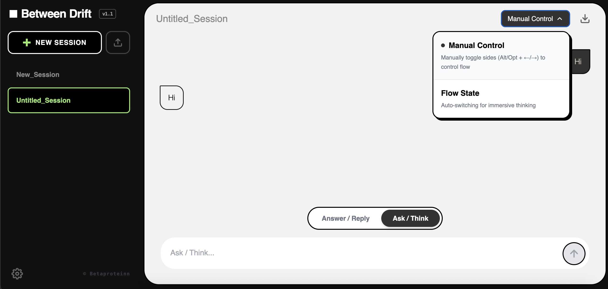

## English

# Between Drift

## What this is

Between Drift is a research-oriented cognitive tool prototype that explores how thinking shifts when perspectives change over time.
Rather than sustaining a single line of thought, it focuses on how attention drifts between positions, questions, and responses.

It is not meant to produce content, but to make directional change in thinking visible.

## Why it exists

When working through complex problems, shifts in perspective often happen implicitly.  
Questions turn into responses, responses invite new questions, and attention moves before we notice it.

Because these shifts are rarely recorded explicitly, it becomes difficult to see:

- where a line of thought changed direction  
- how questions and responses influenced each other  
- when attention drifted rather than progressed  

Between Drift exists to surface these transitions by making alternation explicit.

## What it does

- Provides a two-sided thinking surface, separating prompts and responses  
- Encourages deliberate alternation rather than uninterrupted continuation  
- Supports both manual switching and automatic drift between sides  

These mechanisms are not intended to optimize output,  
but to reveal how changes in stance shape the direction of thinking.

## Why it matters

In exploratory work, moments of transition are often as informative as moments of progress.  
Understanding how attention shifts can clarify why certain ideas emerge, stall, or transform.

Between Drift offers a way to externalize these shifts,  
allowing changes in perspective to be observed rather than assumed.

## Status

Personal research prototype, actively used and iterated.

The concepts and mechanisms in this project do not require holistic understanding.

## How to run

Open `index.html` locally in a browser.

---

## 日本語

# Between Drift

## What this is

Between Drift は、「視点が時間の中で切り替わるとき、
思考がどのように偏移するか」を探るための、研究指向の思考支援プロトタイプです。
  
単一の思考を持続させるのではなく、立場・問い・応答の間で注意がどのように漂うかに着目しています。

これは内容を生み出すためのものではなく、  
思考における転向を可視化するための手段です。

## Why it exists

複雑な問題に取り組む際、視点の変化は多くの場合、暗黙的に起こります。  
問いが応答へと変わり、応答が新たな問いを呼び、注意は気づかないうちに移動していきます。

こうした変化が明示的に記録されないため、次のような点が見えにくくなります：

- 思考がどこで方向転換したのか  
- 問いと応答がどのように影響し合ったのか  
- 注意が前進したのか、それとも漂流したのか  

Between Drift は、切り替えを明示的にすることで、  
これらの移行を表に出すために作られています。

## What it does

- 問いと応答を分けた、二面構造の思考空間を提供します  
- 中断のない継続ではなく、意図的な交替を促します  
- 手動での切り替えと、自動的なドリフトの両方をサポートします  

これらの仕組みはアウトプットを最適化するためのものではなく、  
立場の変化が思考の方向性にどのような影響を与えるかを明らかにすることを目的としています。

## Why it matters

探索的な思考においては、進展の瞬間と同様に、  
転換の瞬間も重要な情報を含んでいます。  
注意がどのように偏移するのかを理解することで、  
アイデアが生まれたり、停滞したり、変化したりする理由が見えてきます。

Between Drift は、こうした視点の移行を外在化し、  
前提とされがちな変化を観察可能にするための手段を提供します。

## Status

個人研究プロトタイプとして、実際の使用を通じて継続的に改良されています。

本プロジェクトの概念や仕組みは、全体を理解することを前提としていません。

## How to run

`index.html` をそのままブラウザで開くことで確認できます。

---

## 中文

# Between Drift

## What this is

Between Drift 是一个用于探索“当视角在时间中发生切换时，思考如何发生偏移”的研究导向思维工具原型。
与持续展开单一思路不同，它关注的是注意力如何在立场、问题与回应之间漂移。

它不是为了产出内容，而是为了让思考中的转向变得可见。

## Why it exists

在处理复杂问题时，视角的转变往往是隐式发生的。  
问题变成回应，回应又引出新的问题，注意力在不被察觉的情况下发生移动。

由于这些转变很少被明确记录，往往难以看清：

- 思考是在何处发生了方向变化  
- 问题与回应是如何相互影响的  
- 注意力是在推进，还是在漂移  

Between Drift 的存在，正是为了通过显式的切换，让这些过渡被看见。

## What it does

- 提供一个双侧的思考界面，将提示与回应分离  
- 鼓励有意识的交替，而非不间断的延续  
- 支持手动切换以及自动漂移两种模式  

这些机制并不用于优化产出，  
而是用于揭示立场变化如何塑造思考的走向。

## Why it matters

在探索性思考中，转折时刻往往与进展本身同样重要。  
理解注意力如何发生偏移，有助于解释某些想法为何出现、停滞或转化。

Between Drift 提供了一种方式，将这些转向外显出来，  
使视角变化可以被观察，而非被默认忽略。

## Status

个人研究原型工具，已在实际使用中持续迭代。

该项目中的概念与机制并不要求被整体理解。

## How to run

直接在浏览器中打开 `index.html` 即可。

---

## License

MIT License

